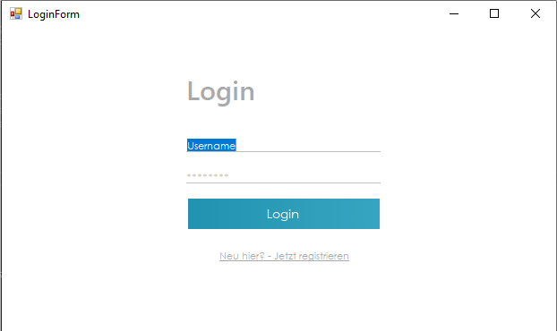

# FitMeUp

## Description

Our product is an interactive fitness software that motivates users to exercise more and supports them in achieving their sporting goals. A profile is created with the parameters entered by the user.
Our product facilitates the written documentation of training and eating units and provides the user with a uniform and general overview.
Furthermore, challenges and exercises are individually suggested to the user to motivate him to achieve his goal more easily and with more joy.

## Technology Tools

- C++ as primary programming language
- .NET as supporting framework
- Windows Forms as a GUI toolkit in the .Net framework
- MySQL database for managing user data and their recommendations
- git revisioning tool
- github for storing this project
- Visual Studio as IDE

## Basic Functionalities

- Creating a user profile
- A profile includes recommendations for water and - calorie intake and training exercises
- Continuous recording of calorie and water intake and exercise sessionsWeekly graphical representation of input data
- View training history
- Challenge function 
- Exercise explanations

## Images

